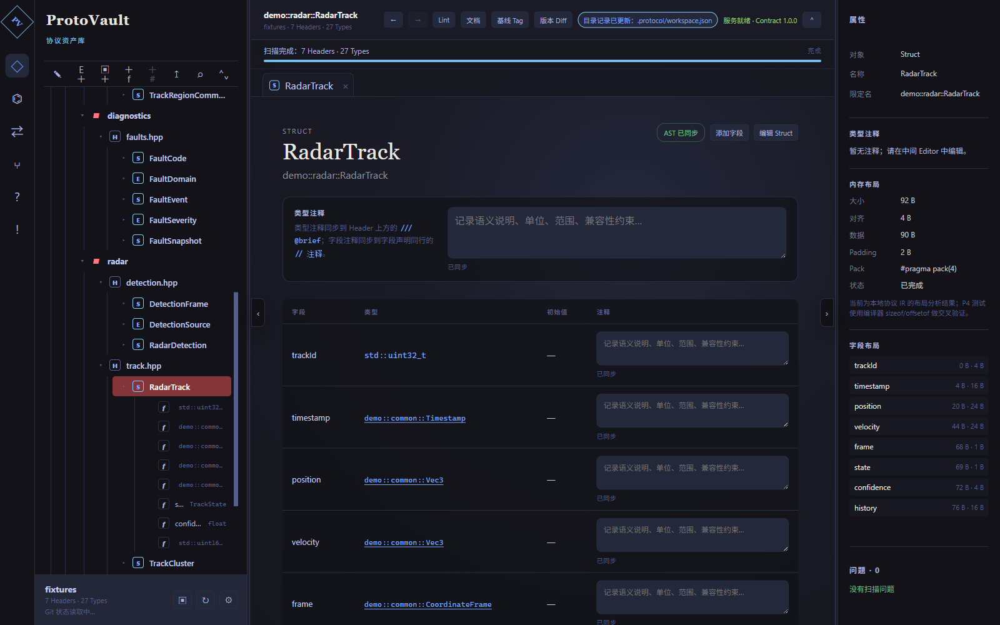
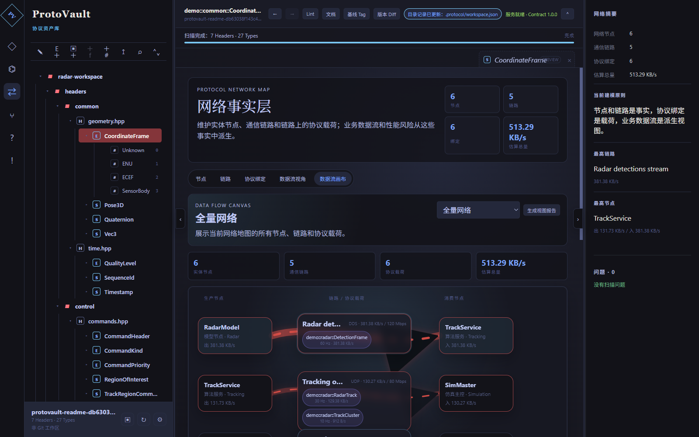
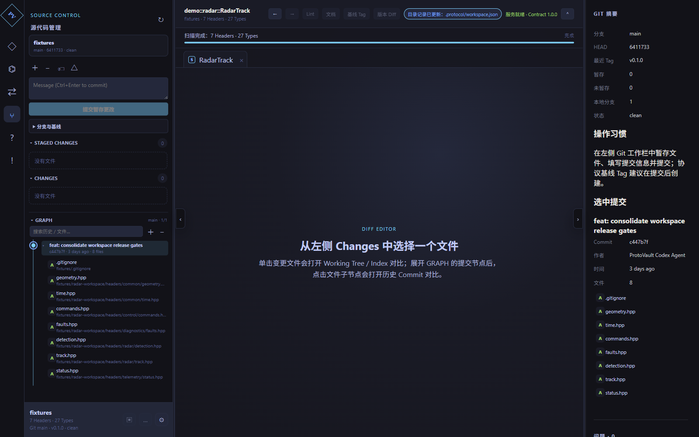

# ProtoVault

[](https://github.com/xin-gao-04/ProtoVault/actions/workflows/ci.yml)


ProtoVault is a Windows-first desktop workbench for managing C++ data protocol assets.

It is not a plain header editor. ProtoVault scans C++ headers, builds a protocol IR, lets you inspect and edit structs/enums/fields, analyzes ABI layout, synchronizes comments and source changes, generates reports, tracks semantic changes with Git baselines, and models protocol traffic on a network data-flow canvas.

> Current state: `v0.1.0` MVP preview. The core workflow is usable, tested, and packaged for Windows. Some production-grade features such as code signing, auto update, SQLite incremental indexing, and full C++ service extraction are still on the roadmap.

## Screenshots

### Protocol workbench

Browse headers as an Obsidian-like tree, open protocol tabs, edit field comments inline, inspect ABI layout, and keep diagnostics visible.



### Network data-flow canvas

Model distributed simulation/runtime nodes, communication links, and protocol bindings. The data-flow canvas highlights producer → link/protocol payload → consumer relationships with bandwidth estimates.



### Source Control / Git workflow

The left Source Control view follows the VS Code mental model: current changes, staged changes, commit message, branch/tag context, expandable commit graph, and diff tabs in the center editor.



## Why ProtoVault exists

Large simulation, radar, robotics, game, and industrial-control projects often keep critical data contracts in C++ headers. Over time, those headers become hard to audit:

- Which structs are protocol assets and which are implementation details?
- Did a field rename break compatibility or just change a label?
- What is the actual `sizeof`, field offset, padding, and pack behavior?
- Which distributed node produces or consumes a protocol?
- What changed between a baseline tag and the current working tree?
- Can a non-C++ specialist understand the data contract without reading every header?

ProtoVault turns C++ headers into a structured, inspectable, versioned protocol workspace.

## Feature overview

- Workspace opening and recursive header discovery, including empty directories.
- C++ header scanning through Clang AST.
- Protocol IR for files, namespaces, structs, enums, fields, type refs, layout, metadata, diagnostics, snapshots/baselines, and semantic changes.
- Struct/enum/field CRUD from the tree, context menu, F2, and editable tables.
- Header source tabs with save/reparse flow and parse-error recovery.
- Field and type comments synchronized back to header source.
- ABI layout summary: size, alignment, offset, padding, pack, enum underlying type.
- Protocol Lint, Markdown documentation, and semantic Diff reports.
- Obsidian-inspired layout, themes, tree search, tabs, split panes, and app-level modal dialogs.
- Protocol relationship graph for header/type dependencies.
- Network map for nodes, links, protocol bindings, FlowView filters, and data-flow reports.
- Source Control view for Git status, staging, commit, branch/tag context, commit graph, and file-level diffs.
- Local AI help assistant backed by modular project knowledge and optional Ollama models.
- Windows installer and portable package via electron-builder.

## Supported C++ header scope

ProtoVault intentionally supports a bounded C++ subset for MVP reliability.

Supported:

- `struct`
- `enum` and `enum class`
- namespace and nested namespace declarations
- fixed-width integer types, floats, bool, char
- struct and enum references
- fixed-size arrays
- limited `typedef` and `using`
- `#include`
- limited `#pragma pack`

Out of editable IR scope:

- macro-generated structs
- complex conditional compilation
- templates
- inheritance
- runtime containers
- functions and methods
- arbitrary C++ metaprogramming

Unsupported constructs should produce diagnostics with source locations instead of being silently ignored.

## Quick start

### Prerequisites

For running the packaged Windows app:

- Windows 10/11
- No separate Git or LLVM/Clang installation is required. The Windows installer bundles the Git and Clang toolchain used by ProtoVault.
- Ollama is optional and only needed for the local AI assistant.

For development and building the installer:

- Windows 10/11
- Node.js 22 or newer
- pnpm 11
- CMake 3.25 or newer
- Visual Studio 2022 Build Tools with the C++ workload
- LLVM/Clang available on PATH, installed in a standard Windows location, or configured through `PROTOVAULT_LLVM_ROOT`
- Git for Windows available on PATH, installed in a standard Windows location, or configured through `PROTOVAULT_GIT_ROOT`

### Install dependencies

```powershell
pnpm install
```

### Start the desktop app

```powershell
pnpm dev
```

In the app, click **加载示例项目** to load the bundled sample workspace.

### Build the Windows installer

```powershell
pnpm release:installer
```

The installer build runs `scripts/prepare-bundled-tools.ps1` and copies a local LLVM/Clang + Git for Windows toolchain into `apps/desktop/vendor-tools/`. That directory is ignored by Git and packaged as Electron `extraResources`.

Generated artifacts:

- `apps/desktop/release/ProtoVault-0.1.0-Setup-x64.exe`
- `apps/desktop/release/ProtoVault-0.1.0-Portable-x64.exe`

Release binaries are intentionally ignored by Git. Upload them through GitHub Releases or another distribution channel.

## Development commands

```powershell
pnpm typecheck
pnpm test
pnpm build
pnpm test:e2e
pnpm core:configure
pnpm core:build
pnpm core:test
```

Full release gate:

```powershell
pnpm release:check
```

This runs TypeScript checks, unit tests, desktop production build, Electron E2E, CMake configure/build, and CTest.

## Repository layout

```text
ProtoVault/
  apps/desktop/             Electron + React desktop app
  packages/contracts/       Shared protocol contracts and schema checks
  services/protocol-core/   C++20 protocol service skeleton and CTest target
  fixtures/                 Stable automated-test workspace
  examples/                 Rich sample workspace for manual exploration
  doc/                      Product plans, release notes, manuals, screenshots
  scripts/                  CMake helpers and agent loop scripts
```

Workspace convention:

```text
workspace/
  headers/
  .protocol/
    workspace.json
    ir/
    meta/
    baselines/
    generated/
    reports/
    cache/
    network/
```

## Architecture

```text
Electron / React UI
        │
        │ typed preload API
        ▼
Electron main workspace service
        │
        ├─ Clang AST scanner
        ├─ protocol IR + metadata persistence
        ├─ source rewrite / validation helpers
        ├─ layout, lint, documentation, diff
        ├─ network map and data-flow reports
        └─ Git source-control integration

C++20 protocol-core service skeleton
        └─ prepared for deeper native parsing/service extraction
```

Business APIs are intentionally kept independent from Electron-specific UI concepts so the local service boundary can evolve over time.

## Git baseline workflow

ProtoVault treats Git branch and tag history as the protocol version backbone:

1. Edit headers or protocol metadata in the workbench.
2. Inspect generated semantic changes, layout changes, and diagnostics.
3. Stage and commit from **Source Control**.
4. Create a baseline tag for a known-good protocol version.
5. Use **版本 Diff** to compare the current workspace against a Git tag/baseline.

This replaces the older standalone snapshot workflow and keeps protocol history aligned with normal repository history.

## Documentation

- [Agent development plan](doc/Agent开发计划.md)
- [Release checklist](doc/发布检查清单.md)
- [User manual](doc/ProtoVault使用手册.md)
- [AI assistant knowledge base](doc/ProtoVaultAI功能知识库.md)
- [Full feature mental model](doc/ProtoVault全功能心智模型_v2026-07-05.md)
- [Development log](doc/开发更新日志.md)

## Roadmap

Near-term:

- Branded application icon.
- Code signing and GitHub Release upload flow.
- More polished Git operations: push/pull, discard, conflict assistance.
- Larger C++ fixture matrix and parser compatibility tests.
- Better first-run onboarding and sample workspace chooser.

Mid-term:

- SQLite incremental index and persistent AST/cache layer.
- Deeper C++ protocol-core service extraction.
- Runtime telemetry import for bandwidth/latency/CPU/GPU bottleneck analysis.
- Richer report export for protocol architecture reviews.
- Optional local AI workflows over workspace-specific protocol knowledge.

## Contributing

The project is still in early MVP shape, so contributions should stay close to the staged plan in `doc/Agent开发计划.md`.

Recommended contribution loop:

1. Open or create an issue describing the protocol-management problem.
2. Add or update fixtures/tests before changing behavior.
3. Keep generated release binaries out of Git.
4. Run `pnpm release:check` before opening a pull request.
5. Document user-facing changes in `doc/开发更新日志.md`.

## License

No open-source license has been selected yet. Treat the repository as source-available until a license file is added.
